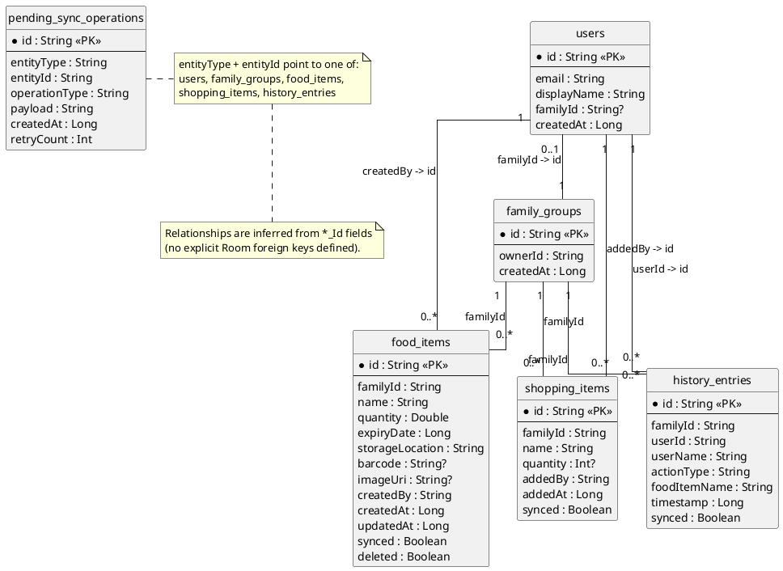

# ERD (PlantUML)

```plantuml
@startuml
hide circle
skinparam linetype ortho

entity "users" as users {
  *id : String <<PK>>
  --
  email : String
  displayName : String
  familyId : String?
  createdAt : Long
}

entity "family_groups" as family_groups {
  *id : String <<PK>>
  --
  ownerId : String
  createdAt : Long
}

entity "food_items" as food_items {
  *id : String <<PK>>
  --
  familyId : String
  name : String
  quantity : Double
  expiryDate : Long
  storageLocation : String
  barcode : String?
  imageUri : String?
  createdBy : String
  createdAt : Long
  updatedAt : Long
  synced : Boolean
  deleted : Boolean
}

entity "shopping_items" as shopping_items {
  *id : String <<PK>>
  --
  familyId : String
  name : String
  quantity : Int?
  addedBy : String
  addedAt : Long
  synced : Boolean
}

entity "history_entries" as history_entries {
  *id : String <<PK>>
  --
  familyId : String
  userId : String
  userName : String
  actionType : String
  foodItemName : String
  timestamp : Long
  synced : Boolean
}

entity "pending_sync_operations" as pending_sync_operations {
  *id : String <<PK>>
  --
  entityType : String
  entityId : String
  operationType : String
  payload : String
  createdAt : Long
  retryCount : Int
}

users "0..1" -- "1" family_groups : familyId -> id
family_groups "1" -- "0..*" food_items : familyId
family_groups "1" -- "0..*" shopping_items : familyId
family_groups "1" -- "0..*" history_entries : familyId

users "1" -- "0..*" food_items : createdBy -> id
users "1" -- "0..*" shopping_items : addedBy -> id
users "1" -- "0..*" history_entries : userId -> id

note right of pending_sync_operations
  entityType + entityId point to one of:
  users, family_groups, food_items,
  shopping_items, history_entries
end note

note bottom
  Relationships are inferred from *_Id fields
  (no explicit Room foreign keys defined).
end note
@enduml
```
